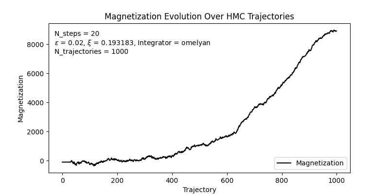

# phi4lattice
> A reproducible, high performance hybrid monte carlo (HMC) engine for $\phi^4$ theory. 


| Phi-field Evolution | Magnetization |
|-------------------|----------------|
|  |  |


**phi4lattice** provides a lightweight framework for simulating real scalar $\phi^4$ field theory on a lattice. It provides a clean, reproducible implementation of Hybrid Monte Carlo (HMC). The codebase and subsequent simulations are designed to support small, simple experiments as well as more serious exploratory simulations.

The core design goals of this project are:

 - Reproducibility – random number handling, trajectory tracking, and fully specified simulation parameters.

 - Performance – JIT'ed dynamics and minimal Python overhead.

 - Modularity – separate components for geometry, model parameters, integrators, observables, and HMC.

 - Usability – suitable both for small-scale problems and more extensive studies.

## Features
- HMC implementation with both leapfrog and omelyan integrators
- Fully JAX accelerated
- Modular architecture
- Unit and functional tests

## Project Structure
```
.
├── env.yml            # dependencies/version control
├── scripts            # example usage
│   ├── example.py
│   └── run_hmc.py
├── src                # code library
│   ├── __init__.py
│   ├── energetics.py    # action, grad S, hamiltonian
│   ├── hmc.py           # HMC engine with MD
│   ├── integrators.py   # leapfrog, Omelyan
│   ├── lattice.py       # Phi4Lattice, fields
│   ├── layout_utils.py  # infers batching
│   ├── observables.py   # ex) magnetization
│   ├── params.py        # configuration dataclasses
│   ├── prng.py          # PRNG key helpers
│   └── test_helpers.py
└── tests
    ├── func_tests
    │   └── test_run_hmc.sh
    └── unit_tests
        ├── test_energetics.py
        ├── test_hmc.py
        ├── test_integrators.py
        ├── test_layout_utils.py
        ├── test_observables.py
        ├── test_params.py
        └── test_prng.py
```

## Installation

From source:

```sh
git clone https://github.com/max-carlin/phi4lattice.git
cd phi4lattice
micromamba create -f env.yml
micromamba activate phi4lattice
```

## Getting Started
After cloning the repository and activating the environment, there are a number of pre-made scripts designed for experimentation. These are:
- `scripts/plot_magnetization.py`
    - Will plot the magnetization over each HMC trajectory for a field configuration.
- `scripts/run_hmc_phi_evolution.py`
    - Will plot each frame of the evolution of the $\phi$ field and compile these evolutions into a video for visualization.
- `scripts/run_hmc.py`
    -Runs a HMC simulation on a 4x4x4x4 lattice. This document and the parameters required to run it can be tuned using argparse command line arguments.

One can also manually set up their own simulation. In the root directory, create a python script and begin by importing the required modules.

```python
import sys
sys.path.append('src')  # noqa
import jax.numpy as jnp
from params import LatticeGeometry, Phi4Params, HMCConfig
from lattice import Phi4Lattice
from observables import magnetization, binder_cumulant
```
Once you have the required imports, construct the required lattice. This example is for a simple 4D lattice with $4^4$ sites and spacing $a = 1$ in each dimension.

```python
# Simple 4D lattice: 4^4 sites, with spacing a = 1 in each dimension.
L_array = jnp.array([4, 4, 4, 4])
a_array = jnp.ones_like(L_array)

# Set up lattice geometry and model parameters
# Simple 4D lattice: 4^4 sites, with spacing a = 1 in each dimension.
geom = LatticeGeometry(spacing_arr=a_array, length_arr=L_array)
model = Phi4Params(lam=1.0, kappa=0.1)
```

Next, configure the desired HMC parameters.

    Parameters
    ----------
    N_steps : int
        Number of integrator steps per trajectory.
    eps : float
        Integrator step size.
    xi : float, optional
        Omelyan integrator parameter. Required when integrator=omelyan.
    integrator : {'leapfrog', 'omelyan'}, default='omelyan'
        Choice of integrator for HMC evolution.
    seed : int, default=2
        Random seed for momentum generation and Metropolis accept/reject.
    N_trajectories : int, default=1
        Number of HMC trajectories to run.
    metropolis : bool, default=True
        Whether to apply Metropolis accept/reject
        at the end of each trajectory.
    record_H : bool, default=False
        If True, store Hamiltonian values along each trajectory.
    verbose : bool, default=False
        If True, print progress information during HMC evolution.


```python
# HMC Configuration
cfg = HMCConfig(
    N_steps=10,
    eps=0.05,
    xi=0.2,
    integrator="omelyan",   # or "leapfrog"
    seed=123,
    N_trajectories=20,
    metropolis=True,
    record_H=False,
    verbose=False,
)
```

Finally, initialize the phi-field and run the HMC trajectories.

```python
lat = Phi4Lattice(model=model, geom=geom)
lat.randomize_phi(
    N_fields=16,
    seed_or_key=0,          # deterministic batch init
    randomize_keys=False,
    dist="normal",
    mu=0.0,
    sigma=1.0,
)

lat.run_HMC(
    cfg=cfg,
    seed=cfg.seed,          # seed for HMC trajectory keys
    randomize_keys=False,   # make it reproducible
    measure_fns_dict=None,  # keep it simple for the example
)

phi_final = lat.phi_x
m = magnetization(phi_final, D=geom.D)
```


**The full script example can be found below.**
```python
import sys
sys.path.append('src')  # noqa
import jax.numpy as jnp
from params import LatticeGeometry, Phi4Params, HMCConfig
from lattice import Phi4Lattice
from observables import magnetization, binder_cumulant

# Simple 4D lattice: 4^4 sites, with spacing a = 1 in each dimension.
L_array = jnp.array([4, 4, 4, 4])
a_array = jnp.ones_like(L_array)

# Set up lattice geometry and model parameters
# Simple 4D lattice: 4^4 sites, with spacing a = 1 in each dimension.
geom = LatticeGeometry(spacing_arr=a_array, length_arr=L_array)
model = Phi4Params(lam=1.0, kappa=0.1)

# HMC Configuration
cfg = HMCConfig(
    N_steps=10,
    eps=0.05,
    xi=0.2,
    integrator="omelyan",   # or "leapfrog"
    seed=123,
    N_trajectories=20,
    metropolis=True,
    record_H=False,
    verbose=False,
)

lat = Phi4Lattice(model=model, geom=geom)
lat.randomize_phi(
    N_fields=16,
    seed_or_key=0,          # deterministic batch init
    randomize_keys=False,
    dist="normal",
    mu=0.0,
    sigma=1.0,
)

lat.run_HMC(
    cfg=cfg,
    seed=cfg.seed,          # seed for HMC trajectory keys
    randomize_keys=False,   # make it reproducible
    measure_fns_dict=None,  # keep it simple for the example
)

phi_final = lat.phi_x
m = magnetization(phi_final, D=geom.D)
```